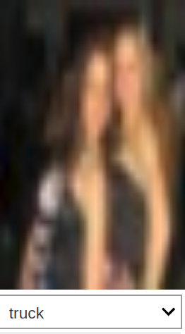
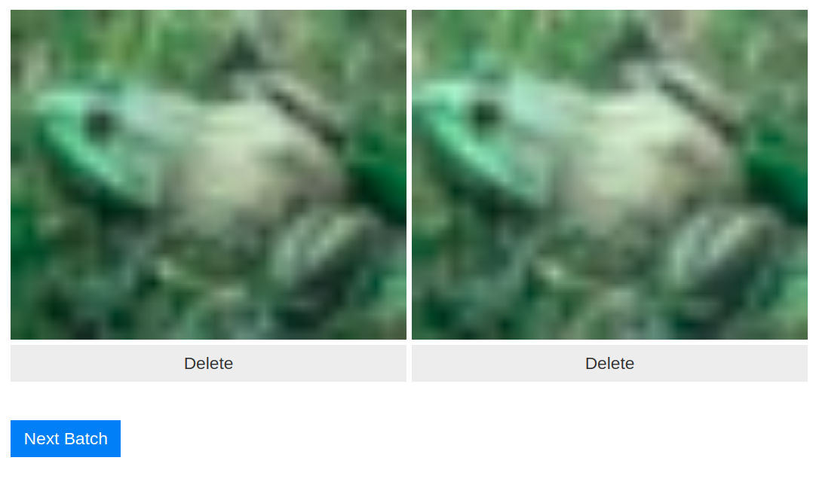
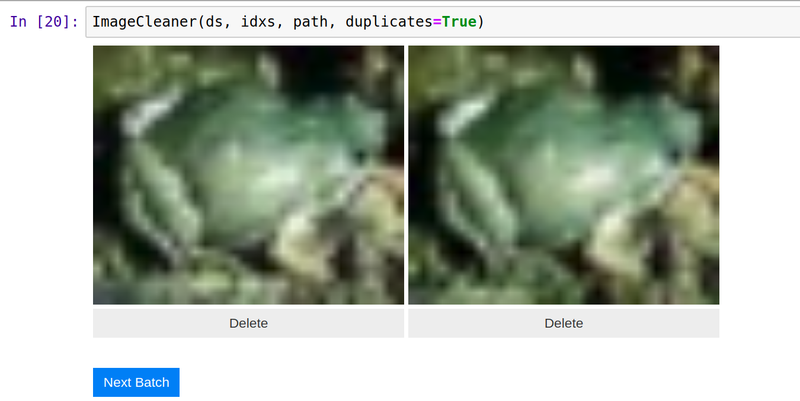

# dataset-cleaner
Notebook with instructions to clean your dataset in with interactive widgets in Jupyter Notebook.

This project consists of a dataset cleaner in Jupyter Notebook with the following functionalities:

- Image Relabeler: suggests mislabeled images and gives the user the option to relabel them (by [Zach Caceres](http://zachcaceres.com/now/) with help from Jason Patnick)
- Image Deleter: suggests images that do not belong to the dataset and gives the user the option to delete them (by [Zach Caceres](http://zachcaceres.com/now/) and Jason Hendrix).

Let's see an example in CIFAR. This doesn't look like a truck does it? Relabel away!

)

- Image Duplicate Deleter: suggests potential duplicates in the dataset and gives the user the option to delete them (by Francisco Ingham)

Let's see a few examples in CIFAR. Found a duplicate? Delete it easily with the tool!

